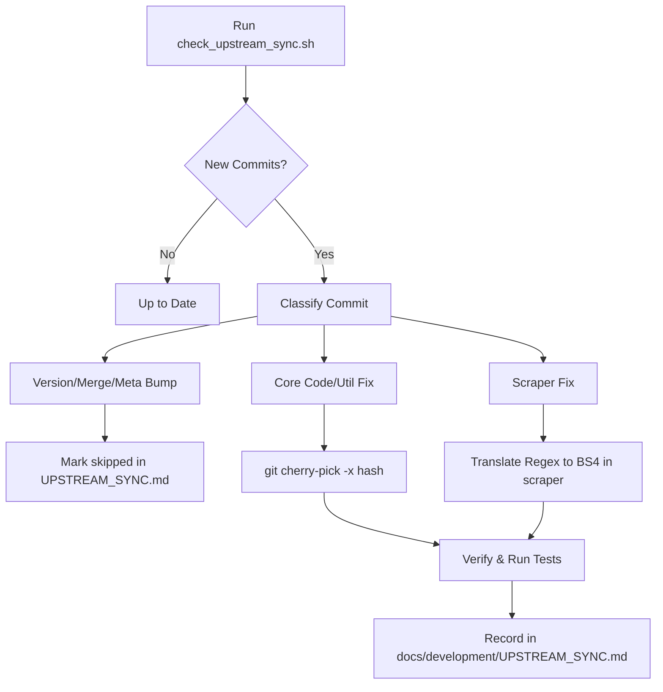

# Upstream Sync Manager

This skill details the process of checking, integrating, and tracking changes from the upstream repository (`dobbelina/repository.dobbelina`) into this modernized fork.

## Workflow Overview



---

## Step 1: Discover New Commits

To check what commits have been introduced upstream that are not yet in our fork, run:

```bash
# On Linux/macOS
./scripts/check_upstream_sync.sh

# On Windows
.\scripts\check_upstream_sync.ps1
```

This script will automatically list all new upstream commits and compare them against `docs/development/UPSTREAM_SYNC.md`.

---

## Step 2: Classify and Integrate Commits

For each commit marked as `🆕 NEW (not yet integrated)`, inspect the changes:

```bash
git show upstream/master:<hash>
```

### Case A: Meta/Packaging Commits
- **Includes**: Version bumps (e.g. `Bumped to v1.1.184`), merge commits, changelog-only changes, or icon uploads.
- **Action**: Mark these as `skipped` in `docs/development/UPSTREAM_SYNC.md` with an explanatory note (e.g., `"Version/package bump only"`).

### Case B: Core Code/Utility Fixes (Non-Scrapers)
- **Includes**: Changes in helper modules, player wrappers, or core dependencies (e.g. `resources/lib/utils.py`, `script.video.F4mProxy`).
- **Action**:
  1. Cherry-pick the commit with the `-x` flag:
     ```bash
     git cherry-pick -x <upstream-hash>
     ```
  2. Resolve any merge conflicts.
  3. Verify with tests: `pytest`.
  4. Record the new fork hash in `docs/development/UPSTREAM_SYNC.md`.

### Case C: Scraper Fixes (Regex to BeautifulSoup4 Translation)
- **Includes**: Bugfixes or site updates in individual scraper files (e.g. `plugin.video.cumination/resources/lib/sites/`).
- **Context**: Upstream uses regex-based scrapers, while our fork uses BeautifulSoup4. Directly cherry-picking these will cause merge conflicts or overwrite our clean BeautifulSoup code.
- **Action**:
  1. View the diff of the scraper in the upstream commit:
     ```bash
     git show <upstream-hash> -- plugin.video.cumination/resources/lib/sites/<site_name>.py
     ```
  2. Identify what logic changed (e.g. a domain change, new search path, updated pagination indicator, or new stream host decryption).
  3. Manually edit our BeautifulSoup4 version of the scraper in `plugin.video.cumination/resources/lib/sites/` to incorporate the functional fix.
  4. Record this in `docs/development/UPSTREAM_SYNC.md` as `manual` or `manual-partial`.

---

## Step 3: Verify and Record

### 1. Test the Site
Always run tests for the affected site before and after applying any changes:

```bash
.venv/bin/pytest tests/sites/test_<site_name>.py
```

If the site tests fail, or if the live scraper breaks, write a local test with a mocked fixture or debug using `codegen.py` (see `kodi-site-maintenance` skill).

### 2. Log in UPSTREAM_SYNC.md
Add the new commit entries under the active sync session in [UPSTREAM_SYNC.md](file:///home/rpeters1428/repository.dobbelina/docs/development/UPSTREAM_SYNC.md). Ensure the table entries strictly follow the schema:

```markdown
| Upstream Hash | Message | Fork Hash | Date Integrated | Notes |
|---------------|---------|-----------|-----------------|-------|
| `upstream-hash`| Commit Message | `fork-hash` / `manual` / `skipped` | YYYY-MM-DD | Details |
```
